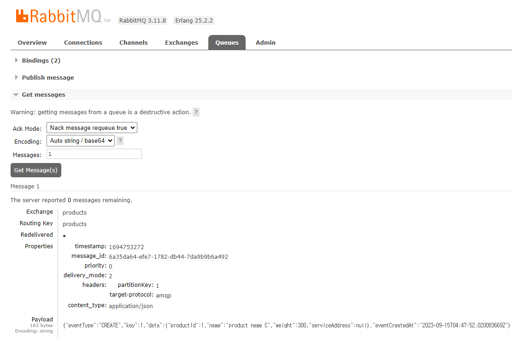
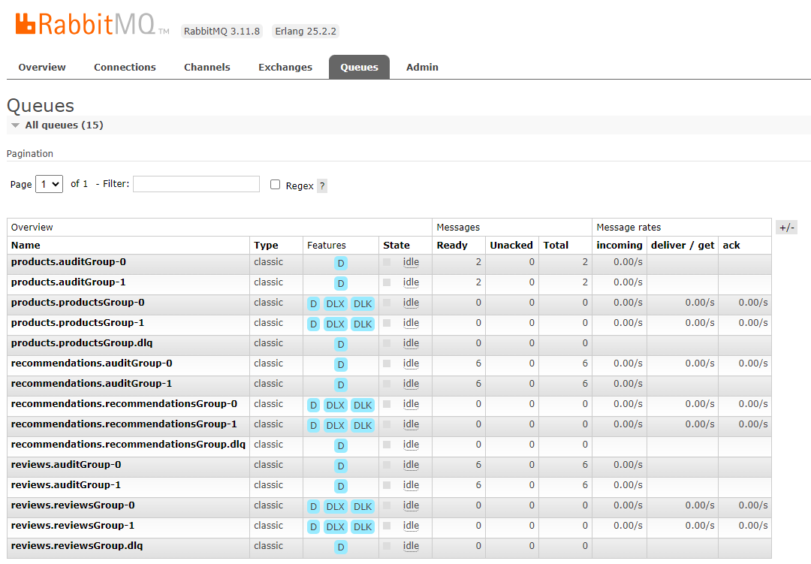
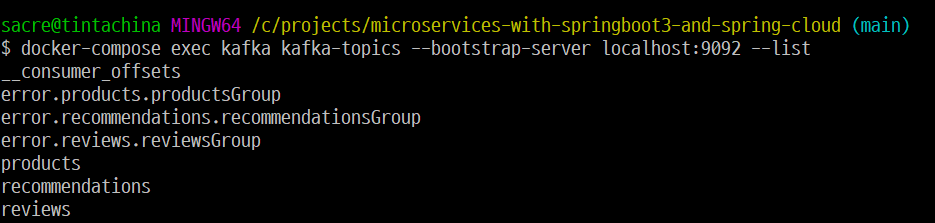
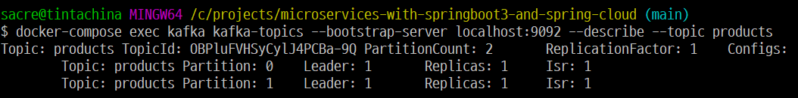
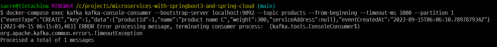

# microservices-with-springboot3-and-spring-cloud
https://www.packtpub.com/product/microservices-with-spring-boot-3-and-spring-cloud-third-edition/9781805128694#_ga=2.83151446.1164592500.1693901026-1509796819.1686212940

## 마이크로서비스의 디자인 패턴

### Service discovery

마이크로서비스는 기동시 동적 IP를 할당받는데 클라이언트는 이를 어떻게 알고 요청할 것인가?

- 해결책 - 현재 가용한 마이크로서비스의 IP와 인스턴스를 추적하는 'Service Discovery' 서비스를 등록한다.

- 해결을 위한 요구사항
    + 자동적으로 마이크로서비스를 등록/해지
    + 클라이언트는 논리적인 엔드포인트로 요청을 할 수 있어야 함. 요청은 사용가능한 마이크로서비스 인스턴스에 라우팅 되어야 함.
    + 요청은 가용한 마이크로서비스에 로드밸런싱 되어야 함.
    + 상태가 건강하지 않은 마이크로서비스를 감지해야 하며 이런 인스턴스에는 요청이 라우팅되지 않아야 함.


### Edge Server

외부에 노출할 마이크로서비스와 내부에 남겨질 마이크로서비스를 구분해야하며 악의적인 클라이언트로부터의 요청으로부터 노출된 마이크로서비스는 보호되어야 한다.

- 해결책 - Edge Server를 추가한다.
  + Note: 때로 Edge Server는 리버스 프록시 역할을 하는 것 같이 보이며 떄로는 Service discovery와 통합되어 동적 로드밸런싱을 수행할 수 있다.


- 해결을 위한 요구사항
  + 설정을 통해 허용된 외부 요청만을 마이크로서비스에 라우팅한다.
  + 표준 프로토콜을 사용하고 OAuth, OIDC, JWT tokens, API keys 등 모범사례를 통해 클라이언트를 신뢰할 수 있음을 보완한다.

### Reactive Microservices

전통적으로 자바 개발자는 Blocking I/O를 통해 동기식 통신을 해왔다. (예: RESTful JSON API over HTTP) Blocking I/O를 사용한다는 것은 요청 길이를 위해 OS로부터 스레드를 할당받는다는 의미다.
동시 요청의 수가 증가하면, 서버는 운영 체제에서 사용 가능한 스레드를 모두 소진하여 응답 시간이 길어지거나 서버가 다운되는 등의 문제가 발생할 수 있다. 일반적으로 마이크로서비스 아키텍처를 사용하면 이러한 문제가 더욱 악화된다. 보통 요청을 처리하기 위해 협력하는 여러 마이크로서비스 체인이 사용된다. 요청을 처리하는 데 참여하는 마이크로서비스의 수가 많을수록 사용 가능한 스레드가 빠르게 고갈된다.

- 해결책 - 다른 서비스(예: 데이터베이스 또는 다른 마이크로서비스)에서 처리가 진행되기를 기다리는 동안 스레드가 할당되지 않도록 비차단 I/O(non-blocking I/O)를 사용한다.

- 해결을 위한 요구사항
  + 가능한 경우, 수신자가 처리를 완료할 때까지 기다리지 않고 메시지를 보내는 비동기 프로그래밍 모델을 사용하라.
  + 만약 동기 프로그래밍 모델을 선호한다면, 응답을 기다리는 동안 스레드를 할당하지 않고 비차단 I/O를 사용하여 동기식 요청을 실행할 수 있는 반응형 프레임워크를 사용하라. 이렇게 하면 마이크로서비스가 작업 부하 증가에 대응하기 위해 확장하기 쉬워진다.
  + 마이크로서비스는 탄력적이고 자체 치유 가능하도록 설계되어야 한다. 탄력적이라 함은 의존하는 서비스 중 하나가 실패해도 응답을 생성할 수 있는 능력을 가지는 것이며, 자체 치유 가능하다 함은 실패한 서비스가 다시 운영 중일 때 마이크로서비스가 해당 서비스를 다시 사용할 수 있어야 한다는 것이다.

### Central configuration

전통적으로 애플리케이션은 설정요소와 함께 배포된다. 예를 들어, 환경 변수의 집합이나 구성 정보를 포함하는 파일 등이다. 마이크로서비스 아키텍처를 기반으로 한 시스템 랜드스케이프(마이크로서비스 아키텍처의 경우, 여러 마이크로서비스 인스턴스가 배치되는 방식과 그들 간의 관계)에서는 많은 수의 마이크로서비스 인스턴스가 배치되므로 몇 가지 질문이 제기된다:

> - 실행 중인 모든 마이크로서비스 인스턴스에 대한 현재 구성 정보 전체 그림을 어떻게 얻을 수 있을까?
> - 구성을 업데이트하고 영향을 받는 모든 마이크로서비스 인스턴스가 올바르게 업데이트되었는지 어떻게 확인할 수 있을까?

- 해결책 - 시스템 랜드스케이프에 구성 서버(configuration server)라는 새로운 구성 요소를 추가하여 모든 마이크로서비스의 구성을 저장한다. 아래 다이어그램에 나타낸 것과 같다.


- 해결을 위한 요구사항 - 마이크로서비스 그룹의 구성 정보를 한 곳에 저장하면서, 개발(dev), 테스트(test), 품질 보증(QA), 생산(prod) 등과 같은 다른 환경에 대해 다른 설정을 할 수 있도록 한다.

### Centralized log analysis

전통적으로, 애플리케이션은 로그 이벤트를 작성하여 애플리케이션이 실행되는 서버의 로컬 파일 시스템에 저장된 로그 파일에 저장한다. 마이크로서비스 아키텍처를 기반으로 한 시스템 랜드스케이프, 즉, 많은 수의 작은 서버에 배포된 대량의 마이크로서비스 인스턴스가 주어진 경우, 다음과 같은 질문을 할지도 모른다:

> - 각 마이크로서비스 인스턴스가 자신의 로컬 로그 파일에 기록할 때, 시스템 랜드스케이프에서 어떤 일이 일어나고 있는지 전체적인 개요를 어떻게 파악할 수 있을까?
> - 마이크로서비스 인스턴스 중 하나가 문제를 겪고 로그 파일에 오류 메시지를 작성하기 시작하면, 어떻게 알 수 있을까?
> - 사용자들이 문제를 보고하기 시작하면, 관련된 로그 메시지를 어떻게 찾을 수 있을까? 즉, 문제의 근본 원인이 되는 마이크로서비스 인스턴스를 어떻게 식별할 수 있을까? 다음 다이어그램은 이 문제를 설명한다.


- 해결책 - 다음 기능을 수행할 수 있는 중앙 집중식 로깅을 관리하는 새로운 컴포넌트를 추가하십시오:

> - 새로운 마이크로서비스 인스턴스를 감지하고 로그 이벤트를 수집
> - 로그 이벤트를 구조화되고 검색 가능한 방식으로 중앙 데이터베이스에 해석 및 저장
> - 로그 이벤트를 쿼리하고 분석하기 위한 API와 그래픽 도구 제공

- 해결을 위한 요구사항
> - 마이크로서비스는 로그 이벤트를 표준 시스템 출력, 즉 stdout에 스트리밍한다. 이렇게 하면 로그 이벤트가 마이크로서비스별 로그 파일에 기록될 때보다 로그 수집기가 로그 이벤트를 찾기 쉬워진다.
> - 마이크로서비스는 '분산 추적 디자인 패턴'에 관한 다음 섹션에서 설명하는 상관 ID로 로그 이벤트를 태그한다.
> - 정규화된 로그 형식이 정의되어, 로그 수집기가 마이크로서비스에서 수집된 로그 이벤트를 중앙 데이터베이스에 저장되기 전에 정규화된 로그 형식으로 변환할 수 있다. 수집된 로그 이벤트를 쿼리하고 분석할 수 있으려면, 정규화된 로그 형식으로 로그 이벤트를 저장해야 한다.


### Distributed tracing

시스템 랜드스케이프에 대한 외부 요청 처리 중 마이크로서비스 간에 흐르는 요청과 메시지를 추적할 수 있어야 한다.
다음은 몇 가지 장애 시나리오의 예다:

> - 사용자들이 특정 실패에 관한 케이스를 제출하기 시작하면, 문제를 일으킨 마이크로서비스, 즉 근본 원인을 어떻게 식별할 수 있을까?
> - 하나의 케이스가 특정 엔티티, 예를 들어 특정 주문 번호와 관련된 문제를 야기한다면, 이 특정 주문을 처리하는 데 관련된 로그 메시지를 어떻게 찾을 수 있을까? 예를 들어, 그것을 처리하는 데 참여한 모든 마이크로서비스에서의 로그 메시지는 어떻게 될까?
> - 사용자들이 너무 긴 응답 시간에 대해 케이스를 제출하기 시작하면, 호출 체인에서 어느 마이크로서비스가 지연을 일으키는지 어떻게 식별할 수 있을까?


- 해결책 - 협력하는 마이크로서비스 간의 처리를 추적하기 위해, 모든 관련 요청과 메시지가 공통 상관 ID로 표시되고 상관 ID가 모든 로그 이벤트의 일부가 되도록 보장해야 한다. 상관 ID를 기반으로 중앙 집중식 로깅 서비스를 사용하여 모든 관련 로그 이벤트를 찾을 수 있다. 로그 이벤트 중 하나가 비즈니스 관련 식별자에 대한 정보도 포함하고 있다면, 예를 들어 고객, 제품 또는 주문의 ID 등, 우리는 상관 ID를 사용하여 그 비즈니스 식별자에 대한 모든 관련 로그 이벤트를 찾을 수 있다.

협력하는 마이크로서비스의 호출 체인에서 지연을 분석할 수 있으려면, 요청, 응답 및 메시지가 각 마이크로서비스에 들어오고 나갈 때의 타임스탬프를 수집할 수 있어야 한다.

- 해결책을 위한 요구사항
> - 표준화된 이름의 헤더와 같은 잘 알려진 위치에서 모든 들어오는 또는 새로운 요청과 이벤트에 고유한 상관 ID를 할당
마이크로서비스가 외부 요청을 하거나 메시지를 보낼 때, 그것은 반드시 요청과 메시지에 상관 ID를 추가해야 함
> - 모든 로그 이벤트는 사전 정의된 형식으로 상관 ID를 포함해야 하므로 중앙 집중식 로깅 서비스가 로그 이벤트에서 상관 ID를 추출하고 검색 가능하게 만들 수 있음
> - 요청, 응답, 그리고 메시지가 마이크로서비스 인스턴스에 들어오고 나갈 때 추적 기록을 생성해야 함

### Circuit breaker

동기식 상호 통신을 사용하는 마이크로서비스의 시스템 랜드스케이프는 실패의 연쇄에 노출될 수 있다. 한 마이크로서비스가 응답을 중단하면, 그 클라이언트들도 문제를 겪게 되어 자신의 클라이언트로부터의 요청에 대해 응답을 중단할 수 있다. 이 문제는 시스템 랜드스케이프 전체에 재귀적으로 전파되어 주요 부분을 마비시킬 수 있다.

이는 특히 동기 요청이 Blocking I/O를 사용하여 실행되는 경우에 일반적이다. 즉, 요청 처리 중에 기본 운영 체제에서 스레드를 차단한다. 많은 수의 동시 요청과 예상치 못하게 느리게 응답하기 시작하는 서비스가 결합되면, 스레드 풀은 금방 소진되어 호출자가 멈추거나/또는 충돌하게 된다. 이러한 실패는 호출자의 호출자로 불쾌하게 빠르게 확산될 수 있다.

- 해결책 - 호출하는 서비스에 문제가 감지되면 새로운 외부 요청을 방지하는 회로 차단기(Circuit breaker)를 추가한다.

- 해결책을 위한 요구사항
> - 서비스에 문제가 감지되면 회로를 열고 빠르게 실패 처리한다. (타임아웃을 기다리지 않음)
> - 실패 수정을 위한 프로브(반 개방 회로라고도 함); 즉, 서비스가 다시 정상적으로 운영되는지 확인하기 위해 정기적으로 단일 요청을 통과시킨다.
> - 프로브가 서비스가 다시 정상적으로 작동하고 있다는 것을 감지하면 회로(circuit)를 닫는다. 이 기능은 시스템 랜드스케이프가 이러한 종류의 문제에 대해 복원력이 있게 하므로 매우 중요하다; 즉, 자체 치유이다.

다음 다이어그램은 마이크로서비스의 시스템 랜드스케이프 내의 모든 동기 통신이 회로 차단기를 통해 이루어지는 시나리오를 보여준다. 모든 회로 차단기는 닫혀 있어, 요청이 가는 서비스에 문제가 감지된 Microservice E의 회로 차단기를 제외하고는 트래픽을 허용한다. 따라서, 이 회로 차단기는 열려 있으며 빠른 실패 로직을 사용한다; 즉, 실패하는 서비스를 호출하고 타임아웃이 발생하기를 기다리지 않는다. 대신, Microservice E는 즉시 응답을 반환할 수 있으며, 선택적으로 응답하기 전에 일부 폴백 로직을 적용할 수 있다.


### Control loop

서버 수에 걸쳐 퍼져 있는 대량의 마이크로서비스 인스턴스가 있는 시스템 랜드스케이프에서는 충돌하거나 멈춘 마이크로서비스 인스턴스와 같은 문제를 수동으로 감지하고 수정하는 것이 매우 어렵다.

- 해결책 - 시스템 랜드스케이프에 새로운 컴포넌트인 컨트롤 루프를 추가한다. 이 과정은 다음과 같이 나타난다.


- 해결을 위한 요구사항  

  컨트롤 루프는 시스템 랜드스케이프의 실제 상태를 지속적으로 관찰하고, 운영자가 지정한 원하는 상태와 비교한다. 두 상태가 다르면 실제 상태를 원하는 상태와 동일하게 만들기 위해 행동을 취한다.

  구현 참고사항: 컨테이너의 세계에서는 보통 쿠버네티스와 같은 컨테이너 오케스트레이터를 사용하여 이 패턴을 구현한다. 15장 '쿠버네티스 소개'에서 쿠버네티스에 대해 더 자세히 알아볼 것이다.

### Centralized monitoring and alarms

관찰된 응답 시간과/또는 하드웨어 자원 사용량이 허용할 수 없을 정도로 높아지면, 문제의 근본 원인을 찾아내기가 매우 어려울 수 있다. 예를 들어, 마이크로서비스 별 하드웨어 자원 소비를 분석할 수 있어야 한다.

- 해석책 - 이를 제어하기 위해, 각 마이크로서비스 인스턴스 단위의 하드웨어 자원 사용에 대한 메트릭을 수집할 수 있는 새로운 컴포넌트인 모니터링 서비스를 시스템 랜드스케이프에 추가한다.

- 해결 요구사항
> - 시스템 랜드스케이프에서 사용하는 모든 서버에서 메트릭을 수집할 수 있어야 한다. 이에는 오토 스케일링 서버가 포함된다.
> - 사용 가능한 서버에서 새롭게 실행되는 마이크로서비스 인스턴스를 감지하고 그들로부터 메트릭을 시작하는 것이 가능해야 한다.
> - 수집된 메트릭을 조회하고 분석하기 위한 API와 그래픽 도구를 제공할 수 있어야 한다.
> - 특정 메트릭이 지정된 임계값을 초과하면 알람이 발생하도록 설정할 수 있어야 한다.

다음 스크린샷은 우리가 20장 '마이크로서비스 모니터링'에서 살펴볼 모니터링 도구인 Prometheus에서 메트릭을 시각화하는 Grafana를 보여준다.


## 소프트웨어 지원도구

우리는 마이크로서비스에 대한 기대를 충족시키고, 무엇보다 중요하게는 그들과 함께 오는 새로운 도전을 처리하는 데 도움을 줄 수 있는 매우 좋은 오픈 소스 도구들을 가지고 있다.

Design Pattern|Spring Boot|Spring Cloud|Kubernetes|Istio
|---------|---------|--------|-------|-------|
**Service discovery**|Netflix Eureka and Spring Cloud LoadBalancer|Kubernetes kube-proxy and service resources
**Edge server**||Spring Cloud Gateway and Spring Security OAuth|Kubernetes Ingress controller|Istio ingress gateway
**Reactive microservices**|Project Reactor and Spring WebFlux
**Central configuration**||Spring Config Server|Kubernetes ConfigMaps and Secrets
**Centralized log analysis**|||Elasticsearch, Fluentd, and Kibana. Note: Actually not part of Kubernetes, but can easily be deployed and configured together with Kubernetes
**Distributed tracing**|Micrometer Tracing and Zipkin|||Jaeger
**Circuit breaker**|Resilience4j|||Outlier detection
**Control loop**|||Kubernetes controller managers
**Centralized monitoring and alarms**||||Kiali, Grafana, and Prometheus


---
# Chapter 03

### Skeleton code for product-service 
```
spring init \
--boot-version=3.0.4 \
--type=gradle-project \
--java-version=17 \
--packaging=jar \
--name=product-service \
--package-name=se.magnus.microservices.core.product \
--groupId=se.magnus.microservices.core.product \
--dependencies=actuator,webflux \
--version=1.0.0-SNAPSHOT \
product-service

spring init \
--boot-version=3.0.4 \
--type=gradle-project \
--java-version=17 \
--packaging=jar \
--name=review-service \
--package-name=se.magnus.microservices.core.review \
--groupId=se.magnus.microservices.core.review \
--dependencies=actuator,webflux \
--version=1.0.0-SNAPSHOT \
review-service

spring init \
--boot-version=3.0.4 \
--type=gradle-project \
--java-version=17 \
--packaging=jar \
--name=recommendation-service \
--package-name=se.magnus.microservices.core.recommendation \
--groupId=se.magnus.microservices.core.recommendation \
--dependencies=actuator,webflux \
--version=1.0.0-SNAPSHOT \
recommendation-service

spring init \
--boot-version=3.0.4 \
--type=gradle-project \
--java-version=17 \
--packaging=jar \
--name=product-composite-service \
--package-name=se.magnus.microservices.composite.product \
--groupId=se.magnus.microservices.composite.product \
--dependencies=actuator,webflux \
--version=1.0.0-SNAPSHOT \
product-composite-service
```

### Build all microservices.
```
./gradlew build
```


#### Adding RESTful API

##### Build, run, execute and kill
```
./gradlew build

java -jar microservices/product-composite-service/build/libs/*.jar &
java -jar microservices/product-service/build/libs/*.jar &
java -jar microservices/recommendation-service/build/libs/*.jar &
java -jar microservices/review-service/build/libs/*.jar &

curl http://localhost:7001/product/123

curl http://localhost:7000/product-composite/1

curl http://localhost:7000/product-composite/1 -s | jq .

# Verify that a 404 (Not Found) error is returned for a non-existing productId (13)
curl http://localhost:7000/product-composite/13 -i
# Verify that no recommendations are returned for productId 113
curl http://localhost:7000/product-composite/113 -s | jq .
# Verify that no reviews are returned for productId 213
curl http://localhost:7000/product-composite/213 -s | jq .
# Verify that a 422 (Unprocessable Entity) error is returned for a productId that is out of range (-1)
curl http://localhost:7000/product-composite/-1 -i
# Verify that a 400 (Bad Request) error is returned for a productId that is not a number, i.e. invalid format
curl http://localhost:7000/product-composite/invalidProductId -i

kill $(jobs -p)
```

./gradlew build 를 실행하면 보통의 jar파일과 class 파일들만 포함된 plain jar파일이 생성된다. plain jar는 필요치 않기 때문에 각 서비스의 build.gradle에 이하의 코드를 추가했다.

```
jar {
    enabled = false
}
```
참조) https://docs.spring.io/spring-boot/docs/3.0.4/gradle-plugin/reference/htmlsingle/#packaging-executable.and-plain-archives


## Deploying Our Microservices Using Docker

Docker 이미지에서 fat JAR 파일의 최적화되지 않은 패키징을 처리할 때 fat JAR 파일의 콘텐츠를 여러 폴더로 추출할 수 있다.
기본적으로 Spring Boot는 fat JAR 파일을 추출한 후 다음 폴더를 생성한다.

- dependencies, 모든 종속성을 JAR 파일로 포함  
- spring-boot-loader, Spring Boot 애플리케이션을 시작하는 방법을 알고 있는 Spring Boot 클래스를 포함  
- snapshot-dependencies, 만약 있다면 스냅샷 종속성을 포함  
- application, 애플리케이션 클래스 파일과 리소스를 포함  

Spring Boot 문서는 위에 나열된 순서대로 각 폴더마다 하나의 Docker 레이어를 생성하는 것을 권장한다.
JDK 기반 Docker 이미지를 JRE 기반 이미지로 대체하고, fat JAR 파일을 Docker 이미지에서 적절한 레이어로 풀어내는 지시사항을 추가한 Dockerfile은 다음과 같다.

```dockerfile
FROM eclipse-temurin:17.0.5_8-jre-focal as builder
WORKDIR extracted
ADD ./build/libs/*.jar app.jar
RUN java -Djarmode=layertools -jar app.jar extract
FROM eclipse-temurin:17.0.5_8-jre-focal
WORKDIR application
COPY --from=builder extracted/dependencies/ ./
COPY --from=builder extracted/spring-boot-loader/ ./
COPY --from=builder extracted/snapshot-dependencies/ ./
COPY --from=builder extracted/application/ ./
EXPOSE 8080
ENTRYPOINT ["java", "org.springframework.boot.loader.JarLauncher"]
```

Dockerfile 작성 후 빌드

```shell
./gradlew :microservices:product-service:build
cd microservices/product-service
docker build -t product-service .
docker images | grep product-service
docker run --rm -p8080:8080 -e "SPRING_PROFILES_ACTIVE=docker" product-service
curl localhost:8080/product/3
```

Running the container in detach mode
```shell
docker run -d -p8080:8080 -e "SPRING_PROFILES_ACTIVE=docker" --name my-prd-srv product-service
docker logs my-prd-srv -f
docker rm -f my-prd-srv
```

docker-compose.yml
```yaml
version: '2.1'
services:
  product: # hostname
    build: microservices/product-service
    mem_limit: 512m
    environment:
      - SPRING_PROFILES_ACTIVE=docker
  recommendation:
    build: microservices/recommendation-service
    mem_limit: 512m
    environment:
      - SPRING_PROFILES_ACTIVE=docker
  review:
    build: microservices/review-service
    mem_limit: 512m
    environment:
      - SPRING_PROFILES_ACTIVE=docker
  product-composite:
    build: microservices/product-composite-service
    mem_limit: 512m
    ports:
      - "8080:8080"
    environment:
      - SPRING_PROFILES_ACTIVE=docker
```

docker compose execute
```shell
./gradlew build
docker-compose build
docker images
docker-compose up -d
docker-compose logs -f
curl localhost:8080/product-composite/123 -s | jq .
docker-compose down
```

automating tests run
```shell
./test-em-all.bash start stop
```

## Adding an API Description Using OpenAPI

product-composite-service/application.yml
```yaml
springdoc:
  swagger-ui.path: /openapi/swagger-ui.html
  api-docs.path: /openapi/v3/api-docs
  packagesToScan: se.magnus.microservices.composite.product
  pathsToMatch: /**

api:

  common:
    version: 1.0.0
    title: Sample API
    description: Description of the API...
    termsOfService: MY TERMS OF SERVICE
    license: MY LICENSE
    licenseUrl: MY LICENSE URL

    externalDocDesc: MY WIKI PAGE
    externalDocUrl: MY WIKI URL
    contact:
      name: NAME OF CONTACT
      url: URL TO CONTACT
      email: contact@mail.com

  responseCodes:
    ok.description: OK
    badRequest.description: Bad Request, invalid format of the request. See response message for more information
    notFound.description: Not found, the specified id does not exist
    unprocessableEntity.description: Unprocessable entity, input parameters caused the processing to fail. See response message for more information

  product-composite:

    get-composite-product:
      description: Returns a composite view of the specified product id
      notes: |
        # Normal response
        If the requested product id is found the method will return information regarding:
        1. Base product information
        1. Reviews
        1. Recommendations
        1. Service Addresses\n(technical information regarding the addresses of the microservices that created the response)

        # Expected partial and error responses
        In the following cases, only a partial response be created (used to simplify testing of error conditions)

        ## Product id 113
        200 - Ok, but no recommendations will be returned

        ## Product id 213
        200 - Ok, but no reviews will be returned

        ## Non numerical product id
        400 - A **Bad Request** error will be returned

        ## Product id 13
        404 - A **Not Found** error will be returned

        ## Negative product ids
        422 - An **Unprocessable Entity** error will be returned
```

product-composite-service/ProductCompositeServiceApplication.java
```java
  @Value("${api.common.version}")         String apiVersion;
  @Value("${api.common.title}")           String apiTitle;
  @Value("${api.common.description}")     String apiDescription;
  @Value("${api.common.termsOfService}")  String apiTermsOfService;
  @Value("${api.common.license}")         String apiLicense;
  @Value("${api.common.licenseUrl}")      String apiLicenseUrl;
  @Value("${api.common.externalDocDesc}") String apiExternalDocDesc;
  @Value("${api.common.externalDocUrl}")  String apiExternalDocUrl;
  @Value("${api.common.contact.name}")    String apiContactName;
  @Value("${api.common.contact.url}")     String apiContactUrl;
  @Value("${api.common.contact.email}")   String apiContactEmail;

  /**
  * Will exposed on $HOST:$PORT/swagger-ui.html
  *
  * @return the common OpenAPI documentation
  */
  @Bean
  public OpenAPI getOpenApiDocumentation() {
    return new OpenAPI()
      .info(new Info().title(apiTitle)
        .description(apiDescription)
        .version(apiVersion)
        .contact(new Contact()
          .name(apiContactName)
          .url(apiContactUrl)
          .email(apiContactEmail))
        .termsOfService(apiTermsOfService)
        .license(new License()
          .name(apiLicense)
          .url(apiLicenseUrl)))
      .externalDocs(new ExternalDocumentation()
        .description(apiExternalDocDesc)
        .url(apiExternalDocUrl));
  }
```

product-composite-service/ProductCompositeService.java
```java
@Tag(name = "ProductComposite", description = "REST API for composite product information.")
public interface ProductCompositeService {

  /**
   * Sample usage: "curl $HOST:$PORT/product-composite/1".
   *
   * @param productId Id of the product
   * @return the composite product info, if found, else null
   */
  @Operation(
    summary = "${api.product-composite.get-composite-product.description}",
    description = "${api.product-composite.get-composite-product.notes}")
  @ApiResponses(value = {
    @ApiResponse(responseCode = "200", description = "${api.responseCodes.ok.description}"),
    @ApiResponse(responseCode = "400", description = "${api.responseCodes.badRequest.description}"),
    @ApiResponse(responseCode = "404", description = "${api.responseCodes.notFound.description}"),
    @ApiResponse(responseCode = "422", description = "${api.responseCodes.unprocessableEntity.description}")
  })
  @GetMapping(
    value = "/product-composite/{productId}",
    produces = "application/json")
  ProductAggregate getProduct(@PathVariable int productId);
}
```

```shell
./gradlew build && docker-compose build && docker-compose up -d
```

#### Open Swagger UI viewer
http://localhost:8080/openapi/swagger-ui.html

productId에 '123' 입력하고 Execute 해본다.

#### 같은 결과
```shell
curl -X GET "http://localhost:8080/product-composite/123" -H "accept: application/json"
```

## Adding Persistence

#### Product, Recommendation - Spring Data for MongoDB  
#### Review - Spring Data for the JPA to access a MySQL database

- 핵심 마이크로서비스에 영속성 레이어 추가하기
- 영속성에 중점을 둔 자동 테스트 작성하기
- 서비스 레이어에서 영속성 레이어 사용하기
- 복합 서비스 API 확장하기
- Docker Compose 환경에 데이터베이스 추가하기
- 새로운 API와 영속성 레이어의 수동 테스트 진행하기
- 마이크로서비스 환경의 자동 테스트 업데이트하기


### *최종 목표 레이어 구조*


#### testContainers를 사용할 때의 단점은 매번 Docker 컨테이너를 기동하기 때문에 시간이 걸린다는 것이다. 복수의 테스트 케이스를 기동하게 되면 케이스의 수에 따라
시간이 증가하게 되는데 이는 테스트를 수행하는 개발자의 생산성을 저하시키는 요인이 될 수 있다. 이를 해결하기 위해 Single Container Pattern(https://www.testcontainers.org/test_framework_integration/manual_lifecycle_control/#singleton-containers)을
사용할 수 있다. 이 패턴을 따르면 base class는 하나의 MySQL 도커 컨테이너를 기동한다. base class는 Review에서 쓰이는 MySqlTestBase.java이다.

```java
public abstract class MySqlTestBase {
  private static MySQLContainer database =
    new MySQLContainer("mysql:8.0.32").withStartupTimeoutSeconds(300);
  
  static {
    database.start();
  }
  @DynamicPropertySource
  static void databaseProperties(DynamicPropertyRegistry registry) {
    registry.add("spring.datasource.url", database::getJdbcUrl);
    registry.add("spring.datasource.username", database::getUsername);
    registry.add("spring.datasource.password", database::getPassword);
  }
}
```
---
> - 데이터베이스 컨테이너는 앞선 예제와 같은 방식으로 선언되며, 컨테이너가 시작하는 데 5분의 확장 대기 시간이 추가된다.
> - 정적 블록은 JUnit 코드가 호출되기 전에 데이터베이스 컨테이너를 시작하는 데 사용된다.
> - 데이터베이스 컨테이너는 시작할 때 몇 가지 속성을 정의받게 된다. 예를 들어 어떤 포트를 사용할 것인지 등이다. 이러한 동적으로 생성된 속성들을 애플리케이션 컨텍스트에 등록하기 위해, static method인 databaseProperties()가 정의된다. 이 메서드는 @DynamicPropertySource로 주석 처리되어 애플리케이션 컨텍스트 내의 데이터베이스 구성을 오버라이드한다. 예를 들어 application.yml 파일에서 가져온 구성 등이다.
---
> - @DataMongoTest: 이 주석은 테스트가 시작될 때 MongoDB 데이터베이스를 시작한다.
> - @DataJpaTest: 이 주석은 테스트가 시작될 때 SQL 데이터베이스를 시작한다.
> - 기본적으로, Spring Boot는 SQL 데이터베이스에 대한 업데이트를 롤백하여 다른 테스트에 부정적인 영향을 최소화하도록 테스트를 구성한다. 하지만 우리의 경우, 이런 동작은 일부 테스트 실패를 유발하게 될것이다. 따라서, 클래스 레벨의 주석 @Transactional(propagation = NOT_SUPPORTED)을 사용하여 자동 롤백을 비활성화 한다.
---

#### Product - PersistenceTests 테스트
```shell
./gradlew microservices:product-service:test --tests PersistenceTests
```

productId에 @Indexed 어노테이션을 unique = true 로 걸어주었다.  
이렇게 설정하면 productId를 기준으로 indexing 테이블이 생성되고 중복된 productId를 가진 Entity의 생성을 금지한다.  
하지만 중복된 productId를 가진 객체가 잘 저장되는 상황이었다.  
mongodb 3.0 이후부터 컬렉션 라이프 사이클과 퍼포먼스에 영향을 주는 것을 막기 위해서 Index creation을 반드시 명시적으로 enable 해주어야 한다고 한다.  
명시적으로 enable 해주기 위해서는 아래와 같이 application.yml 을 설정한다.
```yaml
# application.yml

spring:
  data:
    mongodb:
      auto-index-creation: true
```

### 수동 테스트 Manual tests of the new APIs and the persistence layer
    
```shell
./gradlew build && docker-compose build && docker-compose up
# http://localhost:8080/openapi/webjars/swagger-ui/index.html 접속
# /product-composite 임의의 productId 입력 후 Execute 
docker-compose exec mongodb mongosh product-db --quiet --eval "db.products.find()"
docker-compose exec mongodb mongosh recommendation-db --quiet --eval "db.recommendations.find()"
docker-compose exec mysql mysql -uuser -p review-db -e "select * from reviews"

# get, delete swagger api 모두 테스트 가능
```
---
## Developing Reactive Microservices

> - product-composite 마이크로서비스에 의해 제공되는 생성, 읽기, 삭제 서비스는 비차단 동기 API를 기반으로 할 것이다. composite 마이크로서비스는 웹 및 모바일 플랫폼에서 클라이언트를 가정하고 있으며, 시스템 환경을 운영하는 조직 외부에서 오는 클라이언트도 가정하고 있다. 따라서 동기 API가 자연스럽다.
> - core 마이크로서비스가 제공하는 읽기 서비스도 사용자의 응답을 기다리는 종단 사용자가 있으므로 non-blocking 동기 API로 개발될 것이다.
> - core 마이크로서비스가 제공하는 생성 및 삭제 서비스는 이벤트 기반의 비동기 서비스로 개발될 것으로, 이것은 각 마이크로서비스에 전용된 주제에서 생성 및 삭제 이벤트를 수신한다는 뜻이다.
> - composite 마이크로서비스에 의해 제공되는 동기 API들은 집계된 제품 정보를 생성하고 삭제하기 위해 이러한 topic에 대한 생성 및 삭제 이벤트를 발행할 것이다. 만약 게시 작업이 성공하면 202 (수락됨) 응답으로 반환할 것이며, 그렇지 않으면 오류 응답을 반환할 것이다. 202 응답은 일반적인 200 (OK) 응답과 다르게 – 요청이 수락되었지만 완전히 처리되지 않았음을 나타낸다. 대신 처리 과정은 202응답과 독립적으로 비동기적으로 완료될 것이다.


### Non-blocking REST API 구현

> - API들이 반응형 데이터 타입만 반환하도록 변경하기
> - 서비스 구현을 변경하여 차단 코드를 포함하지 않도록 하기
> - 테스트를 변경하여 반응형 서비스를 테스트할 수 있게 하기
> - 차단 코드 처리 - 아직 차단이 필요한 코드와 비차단 코드를 분리하기


### Blocking code 다루기
리뷰 서비스의 경우, 관계형 데이터베이스에서 데이터에 접근하기 위해 JPA를 사용하는데, 이는 비차단 프로그래밍 모델을 지원하지 않는다. 대신에, blocking 코드를 실행하는 데 능한 스케줄러를 사용하여 한정된 수의 스레드가 있는 전용 스레드 풀에서 blocking 코드를 실행할 수 있다. blocking 코드에 대해 스레드 풀을 사용하면 마이크로서비스에서 사용 가능한 스레드가 소진되는 것을 방지하고, 만약 있다면 마이크로서비스 내의 동시 non-blocking 처리에 영향을 주지 않게 한다.  

1. 스케쥴러 빈을 등록한다.
```java
@Autowired
public ReviewServiceApplication(
  @Value("${app.threadPoolSize:10}") Integer threadPoolSize,
  @Value("${app.taskQueueSize:100}") Integer taskQueueSize
) {
  this.threadPoolSize = threadPoolSize;
  this.taskQueueSize = taskQueueSize;
}
@Bean
public Scheduler jdbcScheduler() {
  return Schedulers.newBoundedElastic(threadPoolSize,
    taskQueueSize, "jdbc-pool");
}
```

2. 서비스에서 jdbcScheduler를 주입한다.
```java
@RestController
public class ReviewServiceImpl implements ReviewService {
  private final Scheduler jdbcScheduler;
  @Autowired
  public ReviewServiceImpl(
    @Qualifier("jdbcScheduler")
    Scheduler jdbcScheduler, ...) {
    this.jdbcScheduler = jdbcScheduler;
  }
```

3. 마지막으로 리액티브 구현에서 scheduler 스레드풀을 사용한다.
```java
@Override
public Flux<Review> getReviews(int productId) {
  if (productId < 1) {
    throw new InvalidInputException("Invalid productId: " + 
      productId);
  }
  LOG.info("Will get reviews for product with id={}", 
    productId);
  return Mono.fromCallable(() -> internalGetReviews(productId))
    .flatMapMany(Flux::fromIterable)
    .log(LOG.getName(), FINE)
    .subscribeOn(jdbcScheduler);
}
private List<Review> internalGetReviews(int productId) {
  List<ReviewEntity> entityList = repository.
    findByProductId(productId);
  List<Review> list = mapper.entityListToApiList(entityList);
  list.forEach(e -> e.setServiceAddress(serviceUtil.
    getServiceAddress()));
  LOG.debug("Response size: {}", list.size());
  return list;
}
```

여기서 차단 코드는 internalGetReviews() 메서드에 위치해 있고, Mono.fromCallable() 메서드를 사용해 Mono 객체로 감싸져 있다. getReviews() 메서드는 subscribeOn() 메서드를 사용해서 jdbcScheduler의 스레드 풀에서 차단 코드를 실행하게 된다.  
나중에 테스트를 돌려보면, 리뷰 서비스로부터 로그 출력을 확인할 수 있다. 그리고 SQL 문장들이 스케줄러의 전용 풀에서 실행되는 걸 확인할 수 있다.


### Non-blocking REST APIs in the composite services
> - API를 변경하여 작업이 반응형 데이터 유형만 반환하도록 한다.
> - 서비스 구현을 변경하여 코어 데이터 서비스의 API를 병렬로 호출하고 블로킹되지 않는 방식으로 한다.
> - 통합 레이어를 변경하여 블로킹되지 않는 HTTP 클라이언트를 사용한다.
> - 리액티브 서비스를 테스트할 수 있도록 테스트를 변경한다.


#### *API의 변경 사항*
복합 서비스의 API를 반응형으로 만들기 위해서는 이전에 설명한 코어 서비스의 API에 적용한 것과 동일한 유형의 변경을 적용해야 한다. 이는 getProduct() 메서드의 반환 유형인 ProductAggregate를 Mono<ProductAggregate>로 대체해야 함을 의미한다.

createProduct() 및 deleteProduct() 메서드는 void 대신 Mono<Void>를 반환하도록 업데이트되어야 한다. 그렇지 않으면 오류 응답을 API 호출자에게 전달할 수 없다.

#### *서비스 구현에서의 변경 사항*
세 개의 API를 병렬로 호출하기 위해 서비스 구현은 Mono 클래스의 정적 zip() 메서드를 사용한다. zip 메서드는 여러 개의 병렬 반응형 요청을 처리하고 모든 요청이 완료되면 이들을 함께 묶어준다. 코드는 다음과 같다.

```java
@Override
public Mono<ProductAggregate> getProduct(int productId) {
  return Mono.zip(
    
    values -> createProductAggregate(
      (Product) values[0], 
      (List<Recommendation>) values[1], 
      (List<Review>) values[2], 
      serviceUtil.getServiceAddress()),
      
    integration.getProduct(productId),
    integration.getRecommendations(productId).collectList(),
    integration.getReviews(productId).collectList())
      
    .doOnError(ex -> 
      LOG.warn("getCompositeProduct failed: {}", 
      ex.toString()))
    .log(LOG.getName(), FINE);
}
```
> - zip 메서드의 첫 번째 매개변수는 'values'라는 배열로 응답을 받는 람다 함수다. 이 배열에는 제품, 추천 목록, 리뷰 목록이 포함된다. 세 개의 API 호출로부터의 응답 집계는 이전과 동일한 helper 메서드인 createProductAggregate()가 처리하며, 어떠한 변경도 없다.
> - 람다 함수 이후의 매개변수들은 zip 메서드가 병렬로 호출할 요청들의 목록으로, 각 요청마다 하나씩 Mono 객체이다. 우리 경우에는 통합 클래스의 메서드에 의해 생성된 세 개의 Mono 객체를 보내며, 각각은 각 코어 마이크로서비스에 전송되는 요청에 대응한다.

#### WebClient를 통해 non-blocking HTTP 호출하기
```java
@Override
public Mono<Product> getProduct(int productId) {
  String url = productServiceUrl + "/product/" + productId;
  return webClient.get().uri(url).retrieve()
    .bodyToMono(Product.class)
    .log(LOG.getName(), FINE)
    .onErrorMap(WebClientResponseException.class, 
      ex -> handleException(ex)
    );
}
```

제품 서비스에 대한 API 호출이 HTTP 오류 응답으로 실패하면 전체 API 요청이 실패한다. WebClient의 onErrorMap() 메서드는 우리의 handleException(ex) 메서드를 호출하며, 이 메서드는 HTTP 계층에서 발생하는 HTTP 예외를 우리 자체의 예외, 예를 들어 NotFoundException 또는 InvalidInputException으로 매핑한다.

그러나 제품 서비스에 대한 호출이 성공하지만 추천 또는 리뷰 API에 대한 호출이 실패하는 경우, 전체 요청이 실패하도록 하고 싶지 않다. 대신 가능한 한 많은 정보를 호출자에게 반환하려고 한다. 따라서 이러한 경우에 예외를 전파하는 대신, 추천 혹은 리뷰의 빈 목록을 반환할 것이다. 오류를 억제하기 위해 onErrorResume(error -> empty())을 호출할 것이다. 코드는 다음과 같다.

```java
@Override
public Flux<Recommendation> getRecommendations(int productId) {
  String url = recommendationServiceUrl + "/recommendation?
  productId=" + productId;
  // Return an empty result if something goes wrong to make it 
  // possible for the composite service to return partial responses
  return webClient.get().uri(url).retrieve()
    .bodyToFlux(Recommendation.class)
    .log(LOG.getName(), FINE)
    .onErrorResume(error -> empty());
}
```

### - 이벤트 주도 비동기 서비스 개발


> - 메시징에 대한 도전 문제 처리
> - 토픽과 이벤트 정의
> - Gradle 빌드 파일에서의 변경 사항
> - 코어 서비스에서 이벤트 소비
> - 복합 서비스에서 이벤트 발행

동기 API 호출보다 비동기 메시지 전송을 선호하더라도, 그 자체로 도전적인 문제들이 따른다. 우리는 Spring Cloud Stream을 어떻게 사용하여 이러한 문제 중 일부를 처리할 수 있는지 살펴볼 것이다. Spring Cloud Stream의 다음 기능에 대해 다룬다.

> - 소비자 그룹
> - 재시도와 데드-레터 큐
> - 보장된 순서와 파티션

#### 소비자 그룹
문제는 메시지 소비자의 인스턴스 수를 늘리면, 예를 들어 제품 마이크로서비스의 인스턴스를 두 개 시작하면, 제품 마이크로서비스의 두 인스턴스 모두 동일한 메시지를 소비하게 된다는 것이다. 이는 다음 다이어그램으로 설명된다.


이로 인해 한 메시지가 두 번 처리되어 데이터베이스에 중복 또는 원치 않는 불일치가 발생할 수 있다. 따라서 우리는 각 메시지를 처리하기 위해 소비자당 하나의 인스턴스만이 필요하다. 이 문제는 다음 다이어그램에서 보여주듯이 소비자 그룹을 도입함으로써 해결할 수 있다.


Spring Cloud Stream에서는 consumer 측에서 consumer 그룹을 설정할 수 있다. 예를 들어, product 마이크로서비스의 경우 다음과 같이 설정한다.
```yaml
spring.cloud.stream:
  bindings.messageProcessor-in-0:
    destination: products
    group: productsGroup
```

> - Spring Cloud Stream은 기본적으로 함수에 구성을 바인딩하기 위한 명명 규칙을 적용한다. 함수로 전송된 메시지의 경우, 바인딩 이름은 <함수이름>-in-<인덱스> 이다:
>   + 함수이름은 앞서 예에서의 함수, messageProcessor의 이름이다.
>   + 인덱스는 함수가 여러 입력 또는 출력 인수를 필요로 하는 경우를 제외하고는 0으로 설정된다. 우리는 다중 인수 함수를 사용하지 않으므로, 예제에서 인덱스는 항상 0으로 설정된다.
>   + 나가는 메시지의 경우, 바인딩 이름 규칙은 <함수이름>-out-<인덱스>이다.
> - destination 속성은 메시지가 소비될 토픽의 이름을 지정하며, 이 경우에는 products이다.
> - group 속성은 제품 마이크로서비스의 인스턴스를 추가할 소비자 그룹을 지정하며, 이 예에서는 productsGroup이다. 이것은 products 토픽에 전송된 메시지가 Spring Cloud Stream에 의해 제품 마이크로서비스의 인스턴스 중 하나만 전달되게 함을 의미한다.

#### 재시도와 배달불능 큐
메시지 처리에 실패한 소비자의 경우, 메시지가 성공적으로 처리될 때까지 다시 큐에 넣을 수 있다.
메시지 내용이 유효하지 않다면, 즉 '독성 메시지(poisoned message)'인 경우, 해당 메시지는 다른 메시지를 처리하는 소비자를 막게 되며 이는 수동으로 제거될 때까지 지속된다.
만약 실패가 일시적인 문제로 인한 것이라면, 예를 들어 일시적인 네트워크 오류로 인해 데이터베이스에 접근할 수 없는 경우, 여러 번의 재시도 후에 처리가 성공할 확률이 높다.

메세지가 결함 분석 및 수정을 위해 다른 저장소로 이동되기 전까지 재시도 횟수를 지정할 수 있어야 합니다. 실패한 메세지는 일반적으로 '데드레터 큐(배달불능 큐)'라고 부르는 전용 큐로 옮겨진다.
예를 들어 네트워크 오류와 같은 일시적인 실패 상황에서 인프라 과부하를 피하기 위해서는 재 시도 횟수와 각 재 시도 사이의 시간 간격을 점차 늘려서 구성할 수 있어야 한다.

Spring Cloud Stream에서 이러한 설정은 소비자 측에서 구성할 수 있으며, 예를 들어 product 마이크로서비스에서 보여주듯이 가능하다.

```yaml
spring.cloud.stream.bindings.messageProcessor-in-0.consumer:
  maxAttempts: 3
  backOffInitialInterval: 500
  backOffMaxInterval: 1000
  backOffMultiplier: 2.0
spring.cloud.stream.rabbit.bindings.messageProcessor-in-0.consumer:
  autoBindDlq: true
  republishToDlq: true
spring.cloud.stream.kafka.bindings.messageProcessor-in-0.consumer:
  enableDlq: true
```

위 예시에서, 메시지를 데드레터 큐에 넣기 전에 Spring Cloud Stream이 3번의 재시도를 수행하도록 지정했다.
첫 번째 재시도는 500ms 후에 시도되고, 나머지 두 번의 시도는 1000ms 후에 이루어진다.
데드레터 큐의 사용을 활성화하는 것은 binding-specific이므로, RabbitMQ와 Kafka 각각에 대한 설정이 있다.

#### 보장된 순서와 파티션
만약 비즈니스 로직에서 메시지가 전송된 순서대로 소비되고 처리되어야 한다면, 처리 성능을 높이기 위해 소비자 당 여러 인스턴스를 사용할 수 없다.
예를 들어, consumer 그룹을 사용할 수 없다. 이는 경우에 따라 들어오는 메시지의 처리에서 허용할 수 없는 지연을 초래할 수 있다.
성능과 확장성을 잃지 않으면서 메시지가 전송된 순서대로 전달되도록 하기 위해 파티션을 사용할 수 있다.
대부분의 경우, 메시지 처리에서 엄격한 순서는 동일한 비즈니스 엔티티에 영향을 주는 메시지에 대해서만 필요하다.
예를 들어, 제품 ID 1에 영향을 주는 메시지는 제품 ID 2에 영향을 주는 메시지와 독립적으로 처리될 수 있는 경우가 많다.
즉, 순서가 보장되어야 하는 것은 동일한 제품 ID를 가진 메시지뿐이다.  
이를 해결하기 위해 각 메시지마다 키를 지정할 수 있도록 하여, 키가 같은 메시지 사이의 순서가 유지될 수 있도록 메시징 시스템이 보장할 수 있게 한다.
이것은 토픽 내에서 서브 토픽 또는 파티션으로 알려진 것들을 도입함으로써 해결될 수 있다. 메시징 시스템은 키를 기반으로하여 메시지를 특정 파티션에 배치한다.
같은 키를 가진 메시지들은 항상 같은 파티션에 배치된다. 그리고 메시징 시스템은 같은 파트션이 내의 모든 메세제들의 전달 순서만 보장하면 된다.
이러한 순서 보장을 위해 우리는 consumer 그룹 내에서 각 파트션이 하나의 컨슈머 인스턴스로 구성되도록 설정한다.
파티션의 개수를 증가함으로써 consumer 인스턴스 개수도 증가 가능하며 이렇게 함으로써 전달 순서와 함께 해당 consumer의 성능도 증대된다.

!()[https://static.packt-cdn.com/products/9781805128694/graphics/Images/B19825_07_10.png]

Spring Cloud Stream에서는 이를 publisher와 consumer 양쪽 모두에서 구성해야 한다. 발행자 측에서는 키와 파티션의 수를 지정해야 한다.
예를 들어, product-composite 서비스의 경우 다음과 같다.

```yaml
spring.cloud.stream.bindings.products-out-0.producer:
  partition-key-expression: headers['partitionKey']
  partition-count: 2
```

이 설정은 키가 partitionKey라는 이름의 메시지 헤더에서 가져와지고 두 개의 파티션을 사용하게 됨을 의미한다.
각 소비자는 메시지를 소비하려는 파티션을 지정할 수 있다. 예를 들어, 상품 마이크로서비스의 경우 다음과 같다.

```yaml
spring.cloud.stream.bindings.messageProcessor-in-0:
  destination: products
  group: productsGroup
  consumer:
    partitioned: true
    instance-index: 0
```

이 설정(instance-index)은 이 소비자가 0번 파티션, 즉 첫 번째 파티션에서만 메시지를 소비하도록 Spring Cloud Stream에 지시한다.

#### *토픽과 이벤트 정의*
메시징 시스템은 일반적으로 헤더와 본문으로 구성된 메시지를 처리한다.
이벤트는 발생한 사건을 설명하는 메시지다. 이벤트의 경우, 메시지 본문은 이벤트 유형, 이벤트 데이터 및 이벤트 발생 시각을 설명하는 데 사용된다.

#### *Gradle 빌드 파일 변경*

#### *core 서비스에서의 이벤트 소비*
애플리케이션에 이러한 변경을 적용하기 위해 다음 단계를 수행해야 한다:  

> - 핵심 서비스의 토픽에 게시된 이벤트를 소비하는 메시지 프로세서 선언: 이 프로세서는 특정 토픽에서 발행된 메시지를 소비하고 해당 메시지에 따라 적절한 작업을 수행한다.
> - 서비스 구현체가 반응형 영속성 계층을 사용하도록 변경: 기존의 동기식 데이터 처리 방식 대신, 비동기식 및 반응형 데이터 처리를 지원하는 영속성 계층을 사용하도록 코드를 수정한다.
> - 이벤트 소비에 필요한 설정 추가: 애플리케이션 설정(예: application.properties 또는 application.yml 파일)에서, 메시징 시스템과의 연결 정보, 구독할 토픽 이름 등 필요한 설정을 추가한다.
> - 이벤트의 비동기 처리를 테스트할 수 있도록 테스트 변경: 기존의 동기식 로직 테스트 대신, 비동기적으로 처리되는 이벤트와 그 결과를 검증하는 테스트 코드가 필요한다.

이러한 모든 변경은 애플리케이션의 확장성과 유연성을 높이며, 시스템 전체의 병목 현상을 줄여준다.

- 메세지 프로세서 정의
```java
@Configuration
public class MessageProcessorConfig {
  private final ProductService productService;
  @Autowired
  public MessageProcessorConfig(ProductService productService) 
  {
    this.productService = productService;
  }
  @Bean
  public Consumer<Event<Integer,Product>> messageProcessor() {
    ...
```

Consumer 구현
```java
return event -> {
  switch (event.getEventType()) {
    case CREATE:
      Product product = event.getData();
      productService.createProduct(product).block();
      break;
    case DELETE:
      int productId = event.getKey();
      productService.deleteProduct(productId).block();
      break;
    default:
      String errorMessage = "Incorrect event type: " + 
        event.getEventType() + 
        ", expected a CREATE or DELETE event";
      throw new EventProcessingException(errorMessage);
  }
};
```

productService 빈에서 발생하는 예외를 메시징 시스템으로 전파할 수 있도록 보장하기 위해, productService 빈에서 받은 응답에 block() 메서드를 호출한다.
이는 메시지 프로세서가 기본 데이터베이스에서의 생성 또는 삭제를 완료하기까지 productService 빈을 기다리도록 보장한다.
block() 메서드를 호출하지 않으면 예외를 전파할 수 없고, 메시징 시스템은 실패한 시도를 다시 큐에 넣거나 가능하면 메시지를 dead-letter 큐로 이동할 수 없다. 대신, 메시지는 조용히 드롭된다.
따라서 반응형 프로그래밍과 함께 사용되는 경우에도 서비스 간의 통신이나 데이터 처리 작업에서 오류가 발생한 경우 이러한 오류 상황을 적절히 처리하고 전파하는 것이 중요하다.
이렇게 하면 문제가 발생한 경우 시스템이 적절한 대응을 할 수 있으며, 필요한 경우 해당 작업을 재실행하거나 다른 대책을 마련할 수 있다.

***
일반적으로 block() 메서드를 호출하는 것은 성능 및 확장성 측면에서 나쁜 관행으로 간주된다.
그러나 이 경우에는 위에서 설명한 것처럼 병렬로 들어오는 몇 가지 메시지만 처리하게 되는데, 파티션 당 하나씩이다.
이는 동시에 차단되는 스레드가 몇 개뿐이므로 성능이나 확장성에 부정적인 영향을 미치지 않는다.
그러나 가능한 한 block() 메서드의 사용을 피하고, 대신 비동기 프로그래밍 기법과 반응형 프로그래밍 모델을 사용하는 것이 좋다.
이런 접근 방식은 시스템의 전체적인 처리 용량을 늘리고, 다양한 작업들 사이에서 자원을 효율적으로 공유할 수 있도록 도와준다.
block() 호출의 필요성이 생기면 그것은 종종 설계상의 문제를 나타내므로, 가능하다면 해당 코드 부분을 리팩토링하여 완전히 비동기화하는 것이 좋다.
***


### 소비(consuming) 이벤트를 위한 설정

1. RabbitMQ가 기본 메세징 시스템이며 기본 Content type은 JSON이다.
```yaml
spring.cloud.stream:
  defaultBinder: rabbit
  default.contentType: application/json
```

2. 다음으로, 메시지 프로세서의 입력을 특정 토픽 이름에 바인딩한다.
```yaml
spring.cloud.stream:
  bindings.messageProcessor-in-0:
    destination: products
```

3. 마지막으로 Kafka와 RabbitMQ의 연결정보를 설정한다.
```yaml
spring.cloud.stream.kafka.binder:
  brokers: 127.0.0.1
  defaultBrokerPort: 9092
spring.rabbitmq:
  host: 127.0.0.1
  port: 5672
  username: guest
  password: guest
---
spring.config.activate.on-profile: docker
spring.rabbitmq.host: rabbitmq
spring.cloud.stream.kafka.binder.brokers: kafka
```

### 테스트 코드 변경

핵심 서비스가 이제 엔티티를 생성하고 삭제하기 위한 이벤트를 받게 되므로, 테스트는 이전 장에서처럼 REST API를 호출하는 대신 이벤트를 보내도록 업데이트해야 한다.
테스트 클래스에서 메시지 프로세서를 호출할 수 있도록, 메시지 프로세서 빈을 멤버 변수에 주입한다.

```java
@SpringBootTest
class ProductServiceApplicationTests {
  @Autowired
  @Qualifier("messageProcessor")
  private Consumer<Event<Integer, Product>> messageProcessor;
```

위 코드에서는 Consumer 함수를 주입하는 것뿐만 아니라 @Qualifier 어노테이션을 사용하여 messageProcessor라는 이름을 가진 Consumer 함수를 주입하려고 지정하는 것을 볼 수 있다.
Consumer 함수 인터페이스 선언에서 메시지 프로세서를 호출하기 위해 accept() 메서드를 사용하는 것에 주목하라.
이는 테스트에서 메시징 시스템을 건너뛰고 메시지 프로세서를 직접 호출한다는 것을 의미한다.

```java
  private void sendCreateProductEvent(int productId) {
    Product product = new Product(productId, "Name " + productId, productId, "SA");
    Event<Integer, Product> event = new Event(CREATE, productId, product);
    messageProcessor.accept(event);
  }
  private void sendDeleteProductEvent(int productId) {
    Event<Integer, Product> event = new Event(DELETE, productId, null);
    messageProcessor.accept(event);
  }
```


### 이벤트 전파

1. HTTP 요청의 본문을 기반으로 이벤트 객체를 생성한다.
2. 이벤트 객체가 페이로드로 사용되고, 이벤트 객체의 키 필드가 헤더의 파티션 키로 사용되는 메시지 객체를 생성한다.
3. 도우미 클래스 StreamBridge를 사용하여 원하는 주제에 이벤트를 게시한다.

```java
  @Override
  public Mono<Product> createProduct(Product body) {
    return Mono.fromCallable(() -> {
      sendMessage("products-out-0", 
        new Event(CREATE, body.getProductId(), body));
      return body;
    }).subscribeOn(publishEventScheduler);
  }
  private void sendMessage(String bindingName, Event event) {
    Message message = MessageBuilder.withPayload(event)
      .setHeader("partitionKey", event.getKey())
      .build();
    streamBridge.send(bindingName, message);
  }
```

### 이벤트 전파(publish)를 위한 설정

> - 통합 계층은 도우미 메서드인 sendMessage()를 사용하여 ProductService 인터페이스의 createProduct() 메서드를 구현한다. 이 helper 메서드는 출력 바인딩의 이름과 이벤트 객체를 받는다. 아래의 설정에서 바인딩 이름 'products-out-0'은 제품 서비스의 주제에 바인딩된다.
> - sendMessage()가 블로킹 코드를 사용하기 때문에, streamBridge를 호출할 때 전용 스케줄러인 'publishEventScheduler'가 제공하는 스레드에서 실행된다. 이는 review 마이크로서비스에서 블로킹 JPA 코드를 처리하는 방식과 같다.
> - helper 메서드인 sendMessage()는 Message 객체를 생성하고, 위에서 설명한 대로 페이로드와 partitionKey 헤더를 설정한다. 마지막으로, 이것은 streamBridge 객체를 사용하여 이벤트를 메시징 시스템에 보내고, 그것은 설정에서 정의된 topic에 게시할 것이다.

```yaml
spring.cloud.stream:
  bindings:
    products-out-0:
      destination: products
    recommendations-out-0:
      destination: recommendations
    reviews-out-0:
      destination: reviews
```

파티션을 사용한다면 다음과 같이 파티션 키와 사용할 파티션의 수를 지정한다.

```yaml
spring.cloud.stream.bindings.products-out-0.producer:
  partition-key-expression: headers['partitionKey']
  partition-count: 2
```


## 수동 테스트

- RabbitMQ 사용 (파티션 없음)
- RabbitMQ 사용 (2 파티션)
- Kafka 사용 (2 파티션)

```shell
./gradlew build && docker-compose build && docker-compose up -d
curl -s localhost:8080/actuator/health | jq -r .status
```

### composite product 생성
```shell
body='{"productId":1,"name":"product name C","weight":300, "recommendations":[
{"recommendationId":1,"author":"author 1","rate":1,"content":"content 1"},
 {"recommendationId":2,"author":"author 2","rate":2,"content":"content 2"},
 {"recommendationId":3,"author":"author 3","rate":3,"content":"content 3"}
], "reviews":[
 {"reviewId":1,"author":"author 1","subject":"subject 1","content":"content 1"},
 {"reviewId":2,"author":"author 2","subject":"subject 2","content":"content 2"},
 {"reviewId":3,"author":"author 3","subject":"subject 3","content":"content 3"}
]}'
curl -X POST localhost:8080/product-composite -H "Content-Type: application/json" --data "$body"
```

### RabbitMQ 확인

http://localhost:15672/#/queues 접속 (admin/admin)

각 주제마다 감사 그룹(auditGroup)을 위한 큐, 해당 핵심 마이크로서비스에서 사용하는 컨슈머 그룹을 위한 큐, 그리고 데드레터(dead-letter) 큐가 있는 것을 볼 수 있다. 또한 예상대로 감사 그룹 큐에 메시지가 포함되어 있는 것도 확인할 수 있다.
이러한 구성은 일반적으로 메시징 시스템에서 사용되는 패턴이다. 각 마이크로서비스는 자체적인 컨슈머 그룹을 가지며, 해당 컨슈머 그룹은 특정 주제를 구독하여 메시지를 처리한다.
동시에 감사(audit)나 모니터링 등의 목적으로 별도의 감사 그룹이나 대기열을 사용하는 것도 일반적이다.
데드레터 큐는 일부 메시징 시스템에서 재처리할 수 없거나 처리 중에 오류가 발생한 메시지를 보관하기 위해 사용된다. 이러한 메시지들은 추후 분석하거나 문제 해결을 위해 검토될 수 있다.



products.auditGroup 큐를 선택하고, 메시지를 확인한다. 이 큐는 감사 그룹을 위한 것이므로, 각 마이크로서비스에서 발생한 이벤트를 포함한다.
이벤트의 페이로드는 JSON 형식이며, 이벤트의 키는 헤더의 partitionKey 키에 저장된다.

#### 저장된 product-composite 정보 조회
```shell
curl -s localhost:8080/product-composite/1
```

#### product-composite 삭제
```shell
curl -X DELETE localhost:8080/product-composite/1
```

#### docker compose down
```shell
docker-compose down
```

### RabbitMQ with partitions

토픽 당 두개의 파티션을 할당한 RabbitMQ docker compose 파일 일부
```yaml
  product-p1:
    build: microservices/product-service
    mem_limit: 512m
    environment:
      - SPRING_PROFILES_ACTIVE=docker,streaming_partitioned,streaming_instance_1
    depends_on:
      mongodb:
        condition: service_healthy
      rabbitmq:
        condition: service_healthy
```

> - 첫 번째 product 인스턴스에 대해 사용했던 것과 동일한 소스 코드와 Dockerfile을 사용하지만, 다르게 구성한다.
> - 모든 마이크로서비스 인스턴스가 파티션을 사용할 것임을 인지하게 하기 위해, 환경 변수 SPRING_PROFILES_ACTIVE에 Spring 프로필 streaming_partitioned를 추가했다.
> - 두 개의 product 인스턴스를 다른 Spring 프로필을 사용하여 다른 파티션에 할당한다. Spring 프로필 streaming_instance_0은 첫 번째 product 인스턴스에서 사용되며, streaming_instance_1은 두 번째 인스턴스인 product-p1에서 사용된다.
> - ***두 번째 제품 인스턴스는 비동기 이벤트만 처리할 것이다. API 호출에 응답하지 않는다. 그것은 다른 이름인 product-p1(그것의 DNS 이름으로도 사용됨)을 가지고 있으므로, http://product:8080으로 시작하는 URL에 대한 호출에 응답하지 않는다.***

#### 서비스 실행 with partitions
```shell
docker-compose build && docker-compose -f docker-compose-partitions.yml up -d
```

product 정보를 생성하면 아래와 같은 큐 상태를 볼 수 있다.



product를 생성하면 auditGroup에 번갈아가며 큐가 추가되는 것을 확인할 수 있다.

```shell
docker-compose down
unset COMPOSE_FILE
```

### Kafka with two partitions per topic

메세지 시스템을 RabbitMQ에서 Apache Kafka로 변경한다.
이는 단순히 spring.cloud.stream.defaultBinder의 값을 kafka로 변경하면 된다.
docker-compose-kafka.yml 파일을 사용하여 Kafka와 Zookeeper를 설정한다.

```shell

```yaml
kafka:
  image: confluentinc/cp-kafka:7.3.1
  restart: always
  mem_limit: 1024m
  ports:
    - "9092:9092"
  environment:
    - KAFKA_ZOOKEEPER_CONNECT=zookeeper:2181
    - KAFKA_ADVERTISED_LISTENERS=PLAINTEXT://kafka:9092
    - KAFKA_BROKER_ID=1
    - KAFKA_OFFSETS_TOPIC_REPLICATION_FACTOR=1
  depends_on:
    - zookeeper
zookeeper:
  image: confluentinc/cp-zookeeper:7.3.1
  restart: always
  mem_limit: 512m
  ports:
    - "2181:2181"
  environment:
    - ZOOKEEPER_CLIENT_PORT=2181
```


#### 실행
```shell
docker-compose build && docker-compose -f docker-compose-kafka.yml up -d
```

#### 테스트
이전과 마찬가지로 product를 2건 생성한다.
Kafka는 그래픽 UI가 없으므로 이하 커맨드를 실행하여 리스트를 확인한다.

```shell
docker-compose exec kafka kafka-topics --bootstrap-server localhost:9092 --list
```



> - error로 시작하는 주제들은 데드레터 큐에 해당하는 토픽들이다.
> - RabbitMQ의 경우처럼 auditGroup 그룹을 찾아볼 수 없다. Kafka에서는 소비자가 이벤트를 처리한 후에도 이벤트가 토픽에 보존되므로, 추가적인 auditGroup 그룹이 필요하지 않다.

특정 토픽의 파티션을 보고 싶다면, 예를 들어 products 토픽의 파티션을 보려면 다음과 같이 실행한다.

```shell
docker-compose exec kafka kafka-topics --bootstrap-server localhost:9092 --describe --topic products
```



특정 파티션의 모든 메세지를 보고 싶다면, 예를 들어 products 토픽의 1번 파티션의 모든 메세지를 보려면 다음과 같이 실행한다.

```shell
docker-compose exec kafka kafka-console-consumer --bootstrap-server localhost:9092 --topic products --from-beginning --timeout-ms 1000 --partition 1
```



출력은 이벤트 내용과 함께 타임아웃 예외로 끝난다. 왜냐하면 커맨드에 대한 타임아웃을 1000ms로 지정하여 명령을 중지하기 때문.

```shell
docker-compose down
unset COMPOSE_FILE
```


